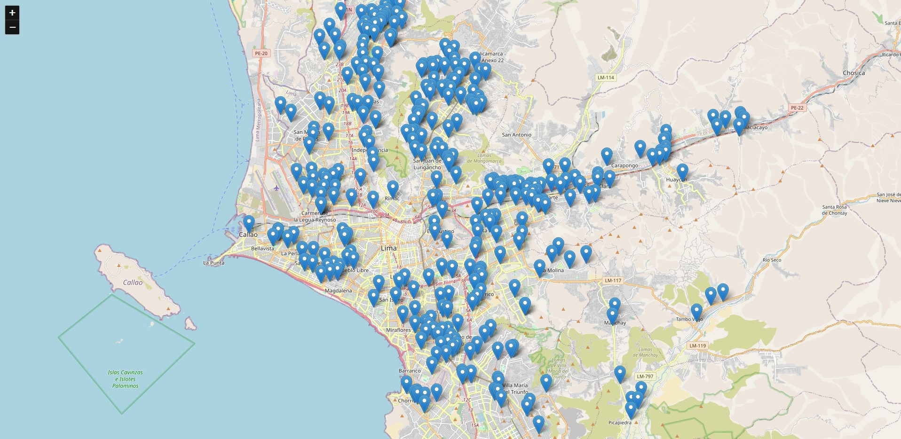
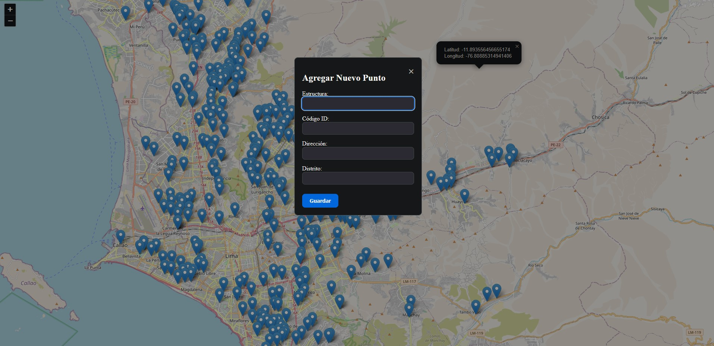
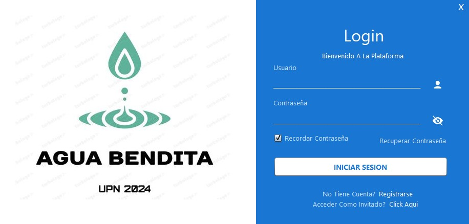
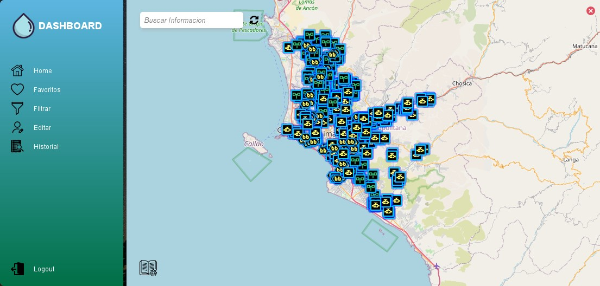
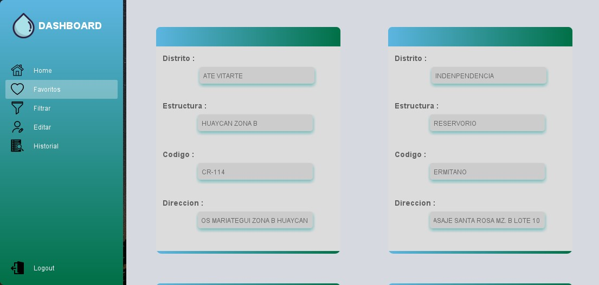
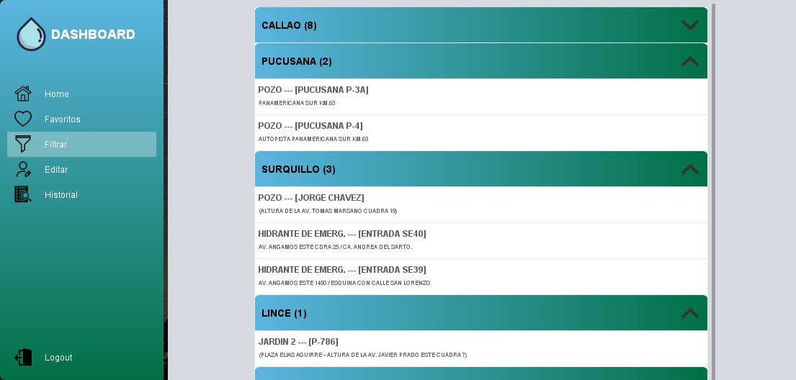
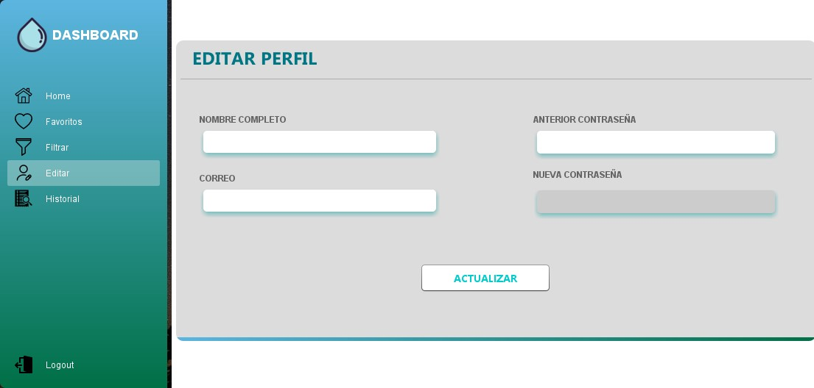
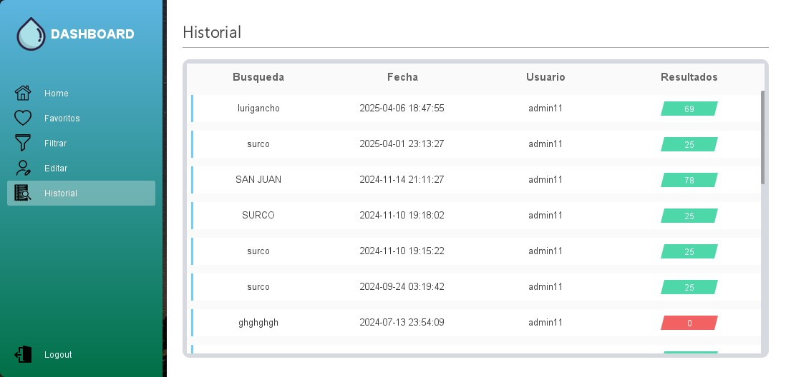

# AquaTrack-Peru

## Visión General

**AquaTrack-Peru** es una aplicación Java de código abierto que proporciona una visualización geoespacial completa de los puntos de abastecimiento de agua en Lima Metropolitana. Esta herramienta interactiva permite a usuarios, investigadores y funcionarios públicos acceder fácilmente a datos críticos sobre los recursos hídricos de la capital peruana.

## Características Principales

- **Mapa Interactivo**: Visualización de alta precisión de todos los puntos de abastecimiento
- **Datos Actualizados**: Información reciente obtenida de fuentes oficiales 
- **Filtros**: Búsqueda por ciudad, distrito, dirección
- **Listado por Distrito**: Lista De Puntos de cierto distrito
- **Favoritos**: Puntos Añadidos como favoritos util para proximas visitas
- **Historial De Busqueda**: Historial De Busqueda y cantidad de resultados de aquella busqueda
- **Edicion de Perfil**: Cambio de contraseña, nombre, correo
- **Recuperacion de Contraseña**: Recuperar la contraseña mediante un pin secreto establecido en el registro 
- **Diseño Responsivo**: Experiencia óptima
- **Panel Administrativo**: Gestión de puntos de abastecimiento 

## Tecnologías Utilizadas

  
  
  
  
  
  
  

## Guía de Instalación

### Requisitos Previos
- Java JDK 21 o superior
- XAMPP (incluye MySQL, PHP y servidor Apache)

### Pasos de Instalación

1. **Configurar XAMPP**
   - Descargar e instalar XAMPP desde [https://www.apachefriends.org/](https://www.apachefriends.org/)
   - Iniciar los servicios de Apache y MySQL desde el panel de control

2. **Configurar la Base de Datos**
   - Abrir phpMyAdmin (http://localhost/phpmyadmin)
   - Crear una nueva base de datos llamada `aguabenditaupn`
   - Importar el archivo SQL ubicado en la carpeta `database/aquatrack_schema.sql`

3. **Configurar la Aplicación**
   - Clonar o descargar este repositorio
   - Copiar los archivos de la carpeta `web` al directorio `htdocs` de XAMPP
   - Usar esta configuracion para la BD 
     usuario: `root`
     ,password : '' (no password)
     ,bd_name : `aguabenditaupn`

4. **Ejecutar la Aplicación**
   - Abrir el proyecto en su IDE y ejecutar

5. **Acceso al Panel Administrativo**
   - URL: http://localhost/admin

## Panel Administrativo

AquaTrack-Peru incluye un panel administrativo con:
- **Actualización de Datos**: Interfaz para actualizar información sobre puntos de abastecimiento

  
  

## Capturas de Pantalla

  
  
  
  
  
  

## Estructura de Datos

La aplicación utiliza datos geoespaciales de los puntos de abastecimiento, incluyendo:
- Coordenadas geográficas (latitud/longitud)
- Tipo de fuente (pozo, reservorio, etc)
- Distrito y zona de servicio

## Licencia

Este proyecto está bajo la Licencia MIT - consulta el archivo [LICENSE.md](LICENSE) para más detalles.

## Contacto

Si tienes preguntas o sugerencias, no dudes en contactarme :)

---

  Hecho con ❤️ para el Perú. Trabajando por un futuro con acceso al agua para todos.

